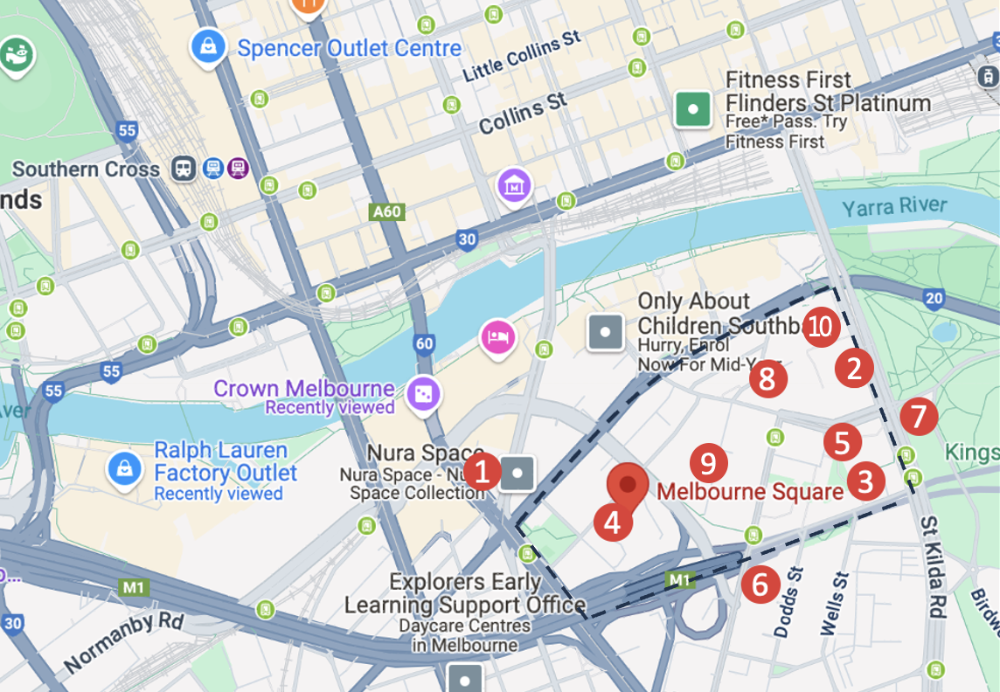

# Real Estate AI

**Real Estate AI** is a real estate presentation tool designed to help property agents better communicate location value to clients. It visualizes nearby amenities on an interactive map and provides Python-powered statistical insights on key property metrics.

## 🚧 Status

This project is currently under active development. Core functionality such as amenity mapping, statistical analysis, and map integration is in progress.

## 🔍 Features (Planned)

- 🗺️ Google Maps-based visualization of nearby schools, transport, shops, etc.
- 📊 Python-based analysis and visualisation of property data (e.g., average prices, walkability, demographic summaries)
- 📈 Data-driven interface to help agents persuade clients with clear visuals and insights
- 🏡 Designed specifically for real estate use cases

## 🛠️ Tech Stack

- **Frontend:** React.js  
- **Backend:** Python
- **Data Analysis:** Python
- **APIs:** Google Maps API, Victoria Government API 

## 💡 Motivation

Many agents struggle to present location value in a clear, persuasive way. Real Estate AI aims to bridge this gap by combining maps, stats, and automation to improve real estate presentations.
